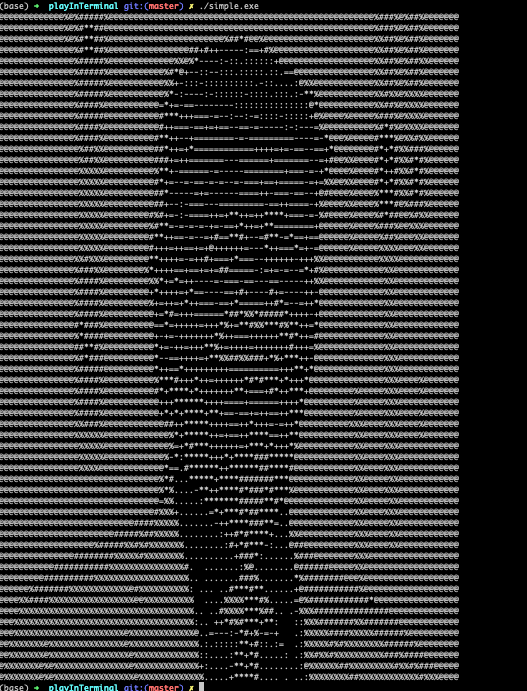

# Play in Terminal  

## Image

A sample program to demonstrate that both image and video are represented as a grid of number.
<p style="clear:both"></p>



<p style="clear:both"></p>

Given the above input image , the program basically displays a different rendering of the same data using characters instead of pixels to show how the underling data is just a bunch of numbers.


## Video
To Check with video, modify as follows (sorry I didn't get the time make this automatic or accept command line args)

In the simple.c file, change the commented line here
```{c}
int getFileType(char *file)
{
	/// TODO: check file type
	// return VIDEO;
	return IMAGE;
}
```

Also here, under main
```{c}
    ...
    SCN_COLS = w.ws_col;
	// char* file = "video.mp4";
	char *file = "image.jpg";
    ....
```
